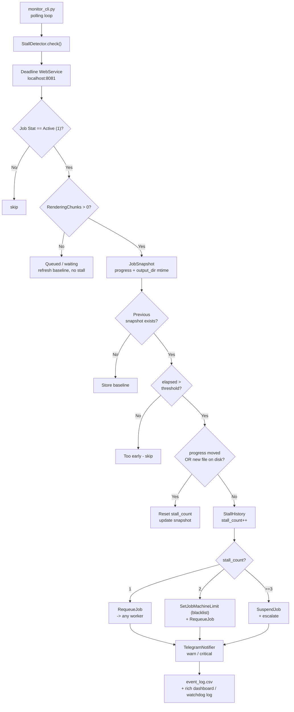

# Deadline Stall Detector

An autonomous watchdog for **Thinkbox Deadline 10.x** render farm environments.

This tool detects silently hung Maya, V-Ray, Redshift, and similar render jobs where progress has stopped and no new files are being written to disk. When a stall is confirmed, it automatically applies a **three-stage escalation** process without requiring human intervention. Operators receive Telegram alerts at each stage and can override the process at any time through the live dashboard or **Thinkbox Deadline Monitor**.

[](https://github.com/armasonix/deadline-stall-detector/actions/workflows/ci.yml)

---

## The Problem

On a render farm with **20+** nodes, **Maya**, **V-Ray**, **Redshift**, and other rendering jobs can sometimes hang silently. The process may still be running, and Deadline may still show the job as **Rendering**, but the progress remains frozen. The cause can vary: a lost texture server connection, poor network stability, V-Ray reaching a memory limit, or an unresponsive Alembic cache disk. In many cases, the supervisor only notices the wasted render time during a manual check, sometimes hours later.

## What This Tool Does

- Polls the Deadline WebService at a configurable interval.
- Detects a **stall** only when **both signals** are missing: no progress change **and** no new files written to disk.
- Separates **actively rendering** jobs from jobs that are simply queued, such as jobs blacklisted from the only available worker and waiting for a free machine.
- Applies automatic escalation by blacklisting the stalled worker before suspending the job.

---

## Architecture



---

## Escalation Logic

| Stall # | Action | Telegram |
|---------|--------|----------|
| 1 | `RequeueJob` -> any available worker | STALLED: {job} — requeue attempt 1 |
| 2 | Blacklist previous worker (`SetJobMachineLimit`) + `RequeueJob` | STALLED AGAIN: {job} — blacklisting {worker} |
| >= 3 | `SuspendJob` — likely scene issue | SCENE ISSUE: {job} — suspended, manual review needed |

On a single-machine farm, when the only worker is already blacklisted, the tier-3 suspend is **skipped** for that job so it stays queued instead of being suspended off the farm entirely.

---

## Project Structure

```text
deadline-stall-detector/
├── deadline_tools/
│   ├── __init__.py
│   ├── __main__.py          # python -m deadline_tools
│   ├── connection.py        # DeadlineCon wrapper + env config
│   ├── stall_detector.py    # JobSnapshot, StallHistory, check()
│   ├── recovery.py          # Three-tier escalation
│   ├── event_log.py         # CSV audit log of recovery actions
│   ├── notifier.py          # Telegram Bot API
│   └── monitor_cli.py       # rich dashboard + watchdog log
├── tests/
│   ├── unit/
│   │   ├── test_stall_detector.py
│   │   ├── test_recovery.py
│   │   └── test_notifier.py
│   └── integration/
│       ├── conftest.py
│       └── test_full_cycle.py
├── test_assets/
│   └── stall_clean.ma       # Maya scene: cube + VRayMtl + Pre-Render sleep
├── .github/workflows/ci.yml
├── terminal-profile.json    # Windows Terminal dark profile
├── pyproject.toml
├── config.example.yaml
├── .env.example
└── requirements.txt
```

---

## Setup

### Requirements

- Python 3.10+
- Thinkbox Deadline 10.x with the WebService enabled

### Install

```bash
pip install -e .          # runtime only
pip install -e ".[dev]"   # runtime + test tooling
```

### Environment Variables

Create your own `.env` file by copying the template from `.env.example` to `.env`, then fill in your values.

```bash
DEADLINE_HOST=localhost
DEADLINE_PORT=8081
DEADLINE_REPO_PATH=C:\DeadlineRepository10
TELEGRAM_BOT_TOKEN=        # from @BotFather - keep secret
TELEGRAM_CHAT_ID=          # numeric chat id
TELEGRAM_PROXY=            # optional: socks5h://host:port or http://user:pass@ip:port
POLL_INTERVAL_SEC=60
STALL_THRESHOLD_MIN=20
```

### Enable the Deadline WebService

Deadline Monitor -> Tools -> Configure Repository Options -> Web Service -> Enable.

Verify with: `curl http://localhost:8081/api/jobs`

---

## Usage

```bash
# Quiet watchdog (default): scrolling event log
python -m deadline_tools

# Live dashboard: single fixed header non-scrolling interface with hotkeys, 
python -m deadline_tools --dashboard

# Custom threshold and poll interval
python -m deadline_tools --threshold 15 --poll 30

# Verbose logging
python -m deadline_tools --log-level DEBUG
python -m deadline_tools --log-level INFO

# help
python -m deadline_tools -help
```

### Dashboard

A n**on-scrolling** interface for managing stalled jobs, adjusting the poll interval, and using hotkeys.

Hotkeys:

#### Hotkeys: 
- `R` requeue,
- `S` suspend,
- `Q` quit.

### Watchdog Output

A scrolling monitor mode that keeps job status updated **row by row**.

```text
Deadline Stall Monitor - watchdog mode (threshold=20m, poll=60s)
------------------------------------------------------------
14:31:02  Monitoring 12 active jobs...
14:32:07  [STALL]: shot_042_beauty requeue #1
14:32:08  [REQUE ] -> render-node-05
14:47:15  [STALL] AGAIN: shot_042_beauty
14:47:16  [BLKLST] worker=render-node-03
15:09:44  [SUSP ]: shot_042_beauty
```

---

## Event Log

Every recovery action is appended to `logs/stall_events.csv` (override the directory with `STALL_LOG_DIR`):

```text
timestamp,job_id,job_name,event,worker,stall_count
```

---

## Tests

```bash
# All tests (no live Deadline required - everything is mocked)
python -m pytest tests -v

# With coverage
python -m pytest tests --cov=deadline_tools --cov-report=term-missing
```

18 tests: 16 unit + 2 integration, all mock-based.

---

## CI

GitHub Actions runs the full test suite on Python 3.10 / 3.11 / 3.12. See `.github/workflows/ci.yml`.

---

## Windows Terminal Profile

Import `terminal-profile.json` into Windows Terminal settings for the Deadline dark theme.

---

## License

MIT
