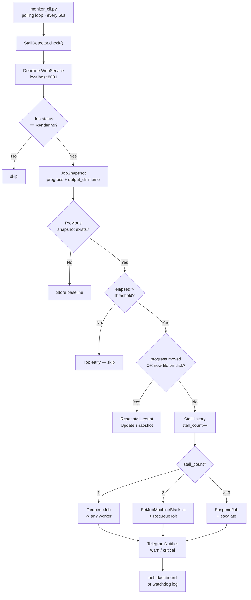

# Deadline Stall Detector

Autonomous watchdog for **Thinkbox Deadline 10.x** render farms.

Detects silently hung Maya + V-Ray jobs (progress frozen + no files written) and applies a **three-tier escalation** without human intervention. Operators receive Telegram alerts at each tier and can override at any time via Deadline Monitor.

---

## The Problem

On a 20-node render farm, Maya/V-Ray jobs occasionally hang silently — process alive, Deadline reports *Rendering*, progress frozen. Root causes vary: lost texture server connection, V-Ray hitting memory ceiling, unresponsive Alembic cache disk. The supervisor only discovers lost render time on manual inspection, sometimes hours later.

## What This Tool Does

- Polls Deadline WebService every N minutes (configurable)
- Declares a **stall** only when **both signals** are absent: no progress movement **and** no new files on disk
- Applies automatic escalation across up to 3 workers before suspending the job

---

## Architecture



---

## Escalation Logic

| Stall # | Action | Telegram |
|---------|--------|----------|
| 1 | `RequeueJob` -> any available worker | ⚠️ STALLED: {job} — requeue attempt 1 |
| 2 | Blacklist previous worker + `RequeueJob` | ⚠️ STALLED AGAIN: {job} — blacklisting {worker} |
| >= 3 | `SuspendJob` — likely scene issue | 🚨 SCENE ISSUE: {job} — suspended, manual review needed |

---

## Project Structure
```text
deadline-stall-detector/
├── deadline_tools/
│ ├── _init_.py
│ ├── _main_.py # python -m deadline_tools
│ ├── connection.py # DeadlineCon wrapper + env config
│ ├── stall_detector.py # JobSnapshot, StallHistory, check()
│ ├── recovery.py # Three-tier escalation
│ ├── notifier.py # Telegram Bot API
│ └── monitor_cli.py # rich dashboard + watchdog log
├── tests/
│ ├── unit/
│ │ ├── test_stall_detector.py
│ │ ├── test_recovery.py
│ │ └── test_notifier.py
│ └── integration/
│ ├── conftest.py
│ └── test_full_cycle.py
├── test_assets/
│ └── stall_test_scene.ma # Maya scene: cube + VRayMtl + Pre-Render sleep
├── terminal-profile.json # Windows Terminal dark profile
├── config.example.yaml
├── requirements.txt
└── .github/workflows/ci.yml
```

---

## Setup

### Requirements

- Python 3.10+
- Thinkbox Deadline 10.x with WebService enabled
- `pip install rich`

### Environment Variables

Copy `.env.example` -> `.env` and fill in your values. **Never commit `.env`.**

```bash
DEADLINE_HOST=localhost
DEADLINE_PORT=8081
DEADLINE_REPO_PATH=C:\DeadlineRepository10
TELEGRAM_BOT_TOKEN=   # from @BotFather — keep secret
TELEGRAM_CHAT_ID=     # numeric chat id
POLL_INTERVAL_SEC=60
STALL_THRESHOLD_MIN=20
```

### Enable Deadline WebService
Deadline Monitor -> Tools -> Configure Repository Options -> Web Service -> Enable


text

Verify: `curl http://localhost:8081/api/jobs`

---

## Usage

```bash
# Load env
export $(cat .env | grep -v '^#' | xargs)

# Quiet watchdog (default)
python -m deadline_tools

# Live dashboard
python -m deadline_tools --dashboard

# Custom threshold and poll interval
python -m deadline_tools --threshold 15 --poll 30

# Verbose logging
python -m deadline_tools --log-level DEBUG
```

### Watchdog Output
```text
Deadline Stall Monitor — watchdog mode (threshold=20m · poll=60s)
──────────────────────────────────────────
14:31:02 Monitoring 12 active jobs...
14:32:07 ⚠ STALLED: shot_042_beauty -> requeue #1
14:32:08 ✓ Requeued -> render-node-05
14:47:15 ⚠ STALLED AGAIN: shot_042_beauty
14:47:16 🔴 Blacklisted: render-node-03
14:47:16 ✓ Requeued -> render-node-07
15:09:44 🚨 SUSPENDED: shot_042_beauty
```

---

## Tests

```bash
# Unit tests only (no Deadline needed)
python -m pytest tests/unit -v

# All tests
python -m pytest tests/ -v
```

16 tests: 13 unit + 3 integration (mock-based, no live Deadline required).

---

## CI

GitHub Actions runs unit tests on every push to `dev` and `main`. See `.github/workflows/ci.yml`.

---

## Windows Terminal Profile

Import `terminal-profile.json` into Windows Terminal settings for the Deadline dark theme.
